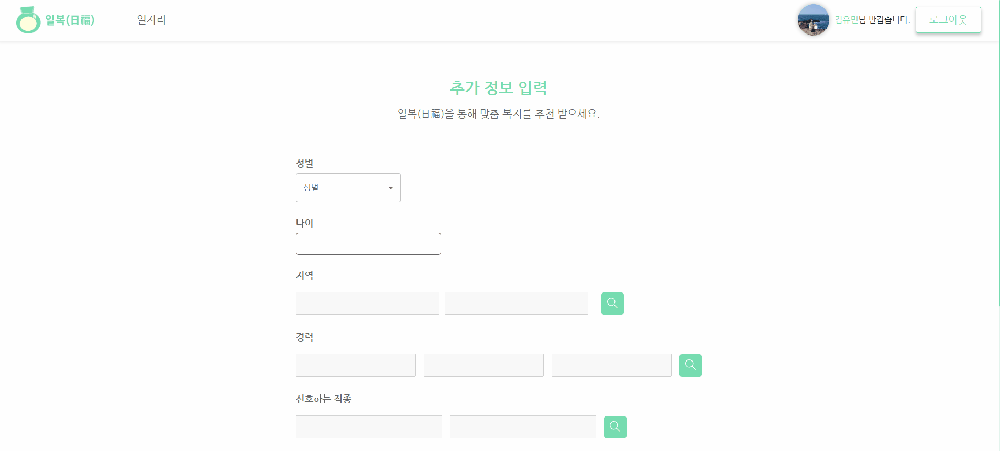

# 기획서

---

## **일복(日福)**

- SSAFY 8기 특화프로젝트 E202 싸라밸
- 2023.02.27 ~ 2023.04.07!!

## 1️⃣ 기획 배경

---

- 고령화사회 → 중장년층, 노인들의 직업 구하기가 힘듦
- 정년퇴직 이후의 직업 구하기가 힘듦
- 기존에 있는 사이트는 추천서비스가 없음

### 🔵 관련기사

---

[정년연장의 ‘역설’, 조기 퇴직↑ 퇴직 연령↓…“고령자 생산성 높여야”](https://www.sedaily.com/NewsView/265V5CUSVS)

[저는 정년퇴직을 앞두고 있는 60세 직장인입니다.  퇴직 이후에도 재취업을 해서 경제활동을 하고 싶은데,  나이를 이유로 거절당하지 않을까 걱정됩니다. < 고령자 일자리 < 카드형 생활법령 : 모바일 찾기 쉬운 생활법령](https://m.easylaw.go.kr/MOB/EasyCsmDetailRetrieve.laf?csmSeq=1696&easySeq=2273)

- **잡코리아 기사**
  
    지난 8월 취업포털 잡코리아가 남녀직장인 532명을 대상으로 ‘노후 일자리 계획’에 대한 설문조사를 실시한 결과, 67.3%가 ‘정년퇴직 이후에도 직장생활을 계속 하고 싶다’고 답했습니다. 또한, 77.3%가 ‘정년 전에 노후까지 계속 일할 수 있는 직장으로 이직할 생각이 있다’고 답했습니다. **고령사회에 진입하면서 많은 직장인들이 퇴직 이전부터 은퇴 후 일자리에 대해 고민하고 있다는 것을 알 수 있는 결과입니다.**
    

****

## 2️⃣ 기획 목표

---

⭐ 빅데이터 기반 추천 알고리즘을 활용하여 중장년층, 노인들의 취업(재취업)을 편리하게 만들어줌

## 3️⃣ 프로젝트 개요 및 기술 스택

---

- 빅데이터 기반 추천 알고리즘을 활용하여 중장년층, 노인들의 노후 일자리를 추천
    - 사용자 정보를 기반으로 알고리즘 구성

<h3> Front-end</h3>

### Back-end

 

 
 
 
  

 

### 데이터 전처리

추천 알고리즘 멘토님의 의견을 반영하여 데이터를 수집하였습니다.

각자의 부모님께 현재 나와있는 공고와 직업 중분류에서 선호하는 공고, 직업, 경력을 조사하였습니다. 

각자가 조사한 부모님의 성별, 나이, 경력과 직업을 선호하는 방향을 취합하여 페르소나를 만들 수 있었습니다. 또한 알바몬과 같은 취업 사이트에서 데이터를 수집하여 이를 통해서 정규 분포와 랜덤을 이용하여 확률상 비슷한 조건을 가진 사람들이 비슷한 공고를 클릭, 좋아요, 지원하는 더미데이터를 만들어서 ColdStart Problem을 해결할 수 있었습니다.

### 일복(日福)

- 일자리 추천, 복지 추천 ( 하루하루 행복한 삶 ) 두 가지 의미를 담고 있음

### 🔵 기능

#### 메인 페이지

#### 검색

#### 일자리 페이지

#### 디테일 페이지

#### 북마크 

#### 디테일 페이지 모달

#### 내 프로필

#### 추가정보 입력

#### 맞춤 일자리 추천

#### 디테일한 추천

#### 디테일한 추천

- 워크넷 API를 통해 구인 공고 제공
- 사용자 정보를 기반으로 어울리는 일자리, 비슷한 나이대의 일자리 추천
- (추가) 복지 서비스

### 반응형 웹 ( 모바일 )

#### 메인 페이지 

#### 로그인 페이지

#### 일자리 페이지

#### 디테일 페이지

#### 프로필 페이지

### 🔵 추천 알고리즘

---

- 추가 정보 입력 → 추천 서비스
    - 나이
    - 지역
    - 경력
    - 희망연봉
    - 관심직종
    - 학력
    - 우대조건

- **비슷한 유저가 관심있는 일자리**
    - Content Filtering
        - 비슷한 유형을 가진 유저의 구인 공고에 대한 가중치를 기반으로 추천
        
        - 가중치
            - 북마크
            - 지원하기
            - 페이지 머무른 시간
    
- **유저와 어울리는 일자리**
    - Content Based Filtering
        - 유저가 입력한 정보만으로 추천
        
        - 나이
        - 지역
        - 경력
        - 학력
        - 희망연봉
        - 관심직종
        - 우대조건

## 5️⃣ 기대 효과

---

- 효과적이고 효율적이게 직업을 선택할 수 있음
- 중장년층, 노인들의 취업(재취업)의 도움이 됨

## 와이어 프레임 pigma

https://www.figma.com/file/jN2sF7cOTMnnHnNCiEuNTy/%EC%8B%B8%EB%9D%BC%EB%B2%A8?node-id=0-1&t=9uwJBGi2XebDOx0r-0

## ERD 

https://www.erdcloud.com/d/ZntnDGv7jSaMHPiNs

## 기능 명세서

https://docs.google.com/spreadsheets/d/1Q8IVA_7fi6wrI20XxxW65WG18fAlhv-8L2MA-6BKJro/edit#gid=0

## api 연동 규격서 
https://docs.google.com/spreadsheets/d/1Q8IVA_7fi6wrI20XxxW65WG18fAlhv-8L2MA-6BKJro/edit#gid=2112477939

